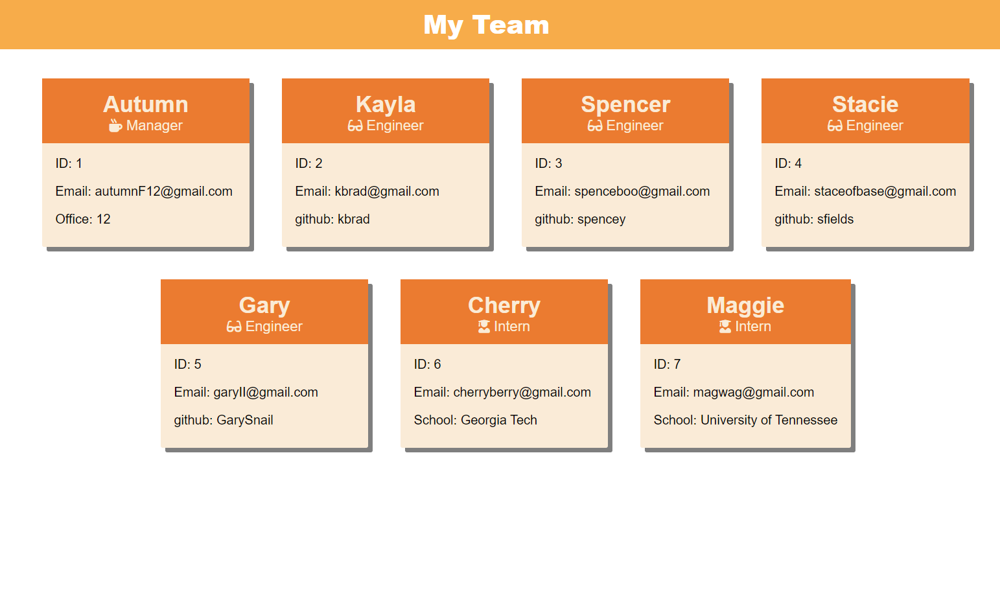

# Team-Profile-Generator

## Description
    For this homework assignment we are tasked with creating an application for generating an HTML file through the use of command line prompts. The generated HTML is a webpage to show information about a workplace team that includes a manager, engineers, and interns. Through the command line prompts, the user inputs information about the members of their team.

Acceptance Criteria:

    GIVEN a command-line application that accepts user input
    WHEN I am prompted for my team members and their information
    THEN an HTML file is generated that displays a nicely formatted team roster based on user input
    WHEN I click on an email address in the HTML
    THEN my default email program opens and populates the TO field of the email with the address
    WHEN I click on the GitHub username
    THEN that GitHub profile opens in a new tab
    WHEN I start the application
    THEN I am prompted to enter the team manager’s name, employee ID, email address, and office number
    WHEN I enter the team manager’s name, employee ID, email address, and office number
    THEN I am presented with a menu with the option to add an engineer or an intern or to finish building my team
    WHEN I select the engineer option
    THEN I am prompted to enter the engineer’s name, ID, email, and GitHub username, and I am taken back to the menu
    WHEN I select the intern option
    THEN I am prompted to enter the intern’s name, ID, email, and school, and I am taken back to the menu
    WHEN I decide to finish building my team
    THEN I exit the application, and the HTML is generated

## Screenshots:
Video of going through command line prompts and viewing the generated README
>https://drive.google.com/file/d/1I7XQPsGlgPD9f36QhNTA00zoAeJIuDh1/view?usp=sharing

Example of a generated HTML:

##  Installation
  Instruction for installing and running project:

*   In your terminal run the command 'npm install' and then the command 'node index.js' to run.
*   Answer the prompts
*   Navigate to the '/dist' folder to find the generated HTML file
